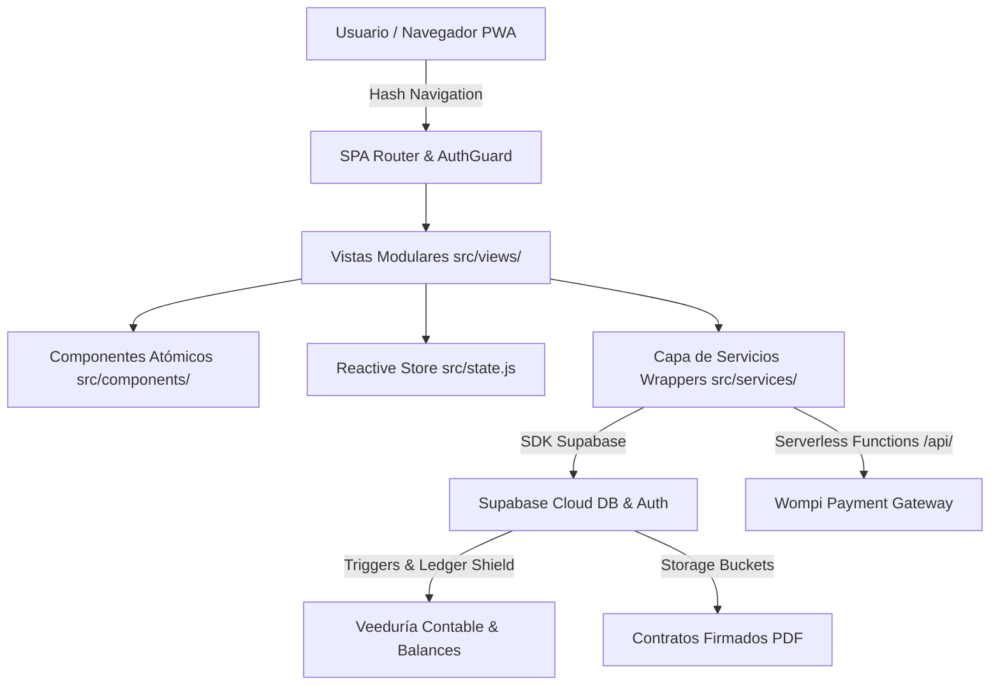
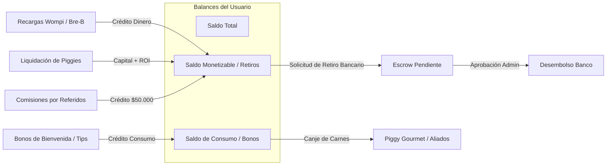

# 🐷 PIGGY APP — BLUEPRINT MAESTRO DE ARQUITECTURA Y ESPECIFICACIONES
## CHECKPOINT OFICIAL: `v2.5.0-GOLD-MASTER-2026`
**Fecha de Emisión:** Marzo 2026  
**Entorno de Producción:** Vercel (`piggy-app-v2`)  
**Repositorio GitHub:** `amsterdamlab/piggy-app-v2`  
**Base de Datos & Auth:** Supabase PostgreSQL Cloud (`elhsvitbqzivgajccify.supabase.co`)  
**Tipo de Aplicación:** SPA (Single Page Application) / PWA (Progressive Web App) Mobile-First  

---

## 📑 ÍNDICE GENERAL

1. [Ficha Técnica y Resumen del Checkpoint](#1-ficha-técnica-y-resumen-del-checkpoint)
2. [Propuesta de Valor y Modelo Agro-Fintech](#2-propuesta-de-valor-y-modelo-agro-fintech)
3. [Arquitectura General del Sistema (Stack & Capas)](#3-arquitectura-general-del-sistema-stack--capas)
4. [Sistema de Diseño Atómico & Design Tokens](#4-sistema-de-diseño-atómico--design-tokens)
5. [Catálogo Integral de Vistas (Rutas) & Modales](#5-catálogo-integral-de-vistas-rutas--modales)
6. [Motor Financiero y Lógica de Negocio](#6-motor-financiero-y-lógica-de-negocio)
7. [Ecosistema de Gamificación & Misiones](#7-ecosistema-de-gamificación--misiones)
8. [Arquitectura de Billetera & Veeduría Contable Blindada](#8-arquitectura-de-billetera--veeduría-contable-blindada)
9. [Modelo de Base de Datos Supabase (Tablas, Triggers y RLS)](#9-modelo-de-base-de-datos-supabase-tablas-triggers-y-rls)
10. [Pasarela de Pagos & Webhooks (Wompi & Bre-B)](#10-pasarela-de-pagos--webhooks-wompi--bre-b)
11. [Módulos Satélite Especiales (Gourmet, Contrato PDF, Noticias, PWA)](#11-módulos-satélite-especiales-gourmet-contrato-pdf-noticias-pwa)
12. [Protocolo de Recuperación Rápida & Plan de Contingencia](#12-protocolo-de-recuperación-rápida--plan-de-contingencia)

---

## 1. FICHA TÉCNICA Y RESUMEN DEL CHECKPOINT

| Parámetro | Especificación |
| :--- | :--- |
| **Identificador del Checkpoint** | `PIGGY-V2.5.0-CHECKPOINT-2026-Q1` |
| **Versión Semántica** | `2.5.0` |
| **Frontend Framework** | Vanilla JavaScript Modular (ES Modules nativos, 0 overhead) |
| **Bundler & Dev Server** | Vite 6.x |
| **Backend as a Service** | Supabase (PostgreSQL 15+, GoTrue Auth, Realtime, Storage) |
| **Generación de Contratos** | `pdf-lib` (Stamping vectorial, canvas de firma y hash SHA-256) |
| **Procesamiento de Pagos** | Wompi API Widget + Webhooks serverless + Bre-B transferencias |
| **Patrón de Estado** | Reactive Pub/Sub Store unificado (`src/state.js`) |
| **Enrutamiento** | Hash SPA Router (`#/ruta`) con AuthGuard y Scroll Reset dinámico |
| **Compatibilidad PWA** | Web App Manifest + Service Worker + Landing dedicada `#/descargar` |

---

## 2. PROPUESTA DE VALOR Y MODELO AGRO-FINTECH

**Piggy App** es una plataforma tecnológica Agro-Fintech diseñada para democratizar y digitalizar la participación de personas naturales en el ciclo productivo de engorde porcino de alta eficiencia en Colombia.

### Pilares del Modelo:
1. **Adopción Digital de Cerdos de Engorde:** Cada usuario adquiere la participación productiva sobre uno o varios cerdos (*Piggies*) a un costo base de **$1.000.000 COP** por unidad.
2. **Ciclo Productivo Fijo:** El ciclo de engorde abarca exactamente **19 semanas (4 meses y 3 semanas / 133 días)**, comenzando en peso lechón (~15 kg) hasta peso de beneficio (~110 kg).
3. **Rentabilidad Escalonada & Aceleradores:**
   - $1\text{ Piggy} \implies 8\%\text{ ROI base}$
   - $2\text{ Piggies} \implies 9\%\text{ ROI base}$
   - $3+\text{ Piggies} \implies 10\%\text{ ROI base}$
   - Aceleradores de Marketplace suman $+1\%$ o $+2\%$ al activo individual.
4. **Cierre de Ciclo Dual:**
   - **Opción A (Monetización):** Retiro bancario del capital invertido más la rentabilidad ganada hacia cualquier cuenta bancaria nacional.
   - **Opción B (Consumo de Carne Premium):** Redención en producto físico despostado o en cortes seleccionados a través de la red de **Aliados** y la tienda **Piggy Gourmet**.

---

## 3. ARQUITECTURA GENERAL DEL SISTEMA (STACK & CAPAS)

La aplicación sigue un principio estricto de **Separación de Responsabilidades (SoC)** y **Desacoplamiento Total**:



### Capas del Sistema:
1. **Capa de Presentación (UI/UX):**
   - Vistas autocontenidas que retornan funciones de limpieza (`cleanup`) al desmontarse.
   - Submódulos desacoplados en `src/views/granja/` para evitar archivos monolíticos.
2. **Capa de Estado (State Management):**
   - Store reactivo centralizado en `src/state.js` basado en el patrón observador (Pub/Sub).
   - Mantiene la sesión del usuario, perfil, cerditos activos, catálogo de mercado, misiones y banderas de interfaz.
3. **Capa de Servicios & Wrappers:**
   - Aislamiento de llamadas de red y SDKs externos.
   - Soporte nativo de **Mock Data Fallback** en `src/services/mockData.js` para desarrollo y pruebas offline continuas.
4. **Capa de Datos y Lógica de Servidor:**
   - Funciones RPC de PostgreSQL y Triggers de base de datos para garantizar que los cálculos financieros no puedan manipularse desde el frontend.

---

## 4. SISTEMA DE DISEÑO ATÓMICO & DESIGN TOKENS

Todo el diseño se rige bajo tokens centralizados en `src/styles/tokens.css` para asegurar consistencia visual y mobile-first:

### Paleta Primaria & Acentos:
- **`--color-primary`:** `#E91E63` (Rosa Fucsia Corporativo Piggy)
- **`--color-primary-dark`:** `#C2185B`
- **`--color-primary-light`:** `#F48FB1`
- **`--gradient-cta`:** `linear-gradient(135deg, #E91E63 0%, #FF4081 50%, #F50057 100%)`
- **`--gradient-offer`:** `linear-gradient(135deg, #E91E63 0%, #AD1457 100%)`

### Fondos & Superficies:
- **`--color-bg`:** `#FDF2F5` (Fondo suave pastel)
- **`--color-bg-card`:** `#FFFFFF`
- **`--color-bg-input`:** `#F9F5F6`
- **`--color-border`:** `#F0E6E9`

### Tipografía & Escala:
- **Fuente Principal:** `'Inter', -apple-system, BlinkMacSystemFont, 'Segoe UI', Roboto, sans-serif`
- **Escalas:** `12px` (xs), `13px` (sm), `14px` (base), `16px` (md), `18px` (lg), `20px` (xl), `24px` (2xl), `30px` (3xl).

### Layout Móvil Estricto:
- **`--app-max-width`:** `480px` (Contenedor centrado en desktop, fluido en móviles).
- **`--bottom-nav-height`:** `72px`
- **`--header-height`:** `56px`

---

## 5. CATÁLOGO INTEGRAL DE VISTAS (RUTAS) & MODALES

### Mapa de Rutas Registradas en `src/router.js`:

| Ruta Hash | Vista | Archivo Fuente | Requiere Auth | Descripción |
| :--- | :--- | :--- | :---: | :--- |
| `#/auth` | Autenticación | `src/views/AuthView.js` | No | Login, Registro, Google OAuth, Recuperación de clave. |
| `#/granja` | Dashboard Granja | `src/views/GranjaView.js` | **Sí** | Centro de control de cerdos, pesos, tips y accesos a billetera. |
| `#/mercado` | Marketplace | `src/views/MercadoView.js` | **Sí** | Compra de Piggies estándar, aceleradores y lotes especiales. |
| `#/aliados` | Red de Aliados | `src/views/AliadosView.js` | **Sí** | Directorio de restaurantes y carnicerías aliadas con beneficios. |
| `#/gourmet` | Piggy Gourmet | `src/views/PiggyGourmetView.js` | **Sí** | E-commerce de cortes finos y combos parrilleros. |
| `#/adopcion` | Wizard Adopción | `src/views/AdopcionView.js` | **Sí** | Calculadora dinámica de adopción y selección de cantidad. |
| `#/contrato` | Contrato Legal | `src/views/ContratoView.js` | **Sí** | Vista legal con firma digital interactiva y descarga en PDF. |
| `#/piggy/:id` | Ficha de Piggy | `src/views/PiggyDetailView.js` | **Sí** | Detalle de evolución de peso, alimentación y simulación 3D. |
| `#/referidos` | Programa Afiliados | `src/views/ReferidosView.js` | **Sí** | Código único, link de invitación, QR y comisiones ganadas. |
| `#/perfil` | Perfil & Ledger | `src/views/ProfileView.js` | **Sí** | Datos personales, verificación KYC, historial contable y banco. |
| `#/descargar` | Instalador PWA | `src/views/DescargarView.js` | No | Landing pública para instalación de app en iOS y Android. |

### Ecosistema Modular de Sub-Modales (`src/views/granja/`):
1. **`WalletBlock.js`:** Banner de saldo en Granja con acceso rápido a recargar y retirar.
2. **`WalletDrawerModal.js`:** Cajón principal de la billetera con desglose de saldo y movimientos.
3. **`WalletRechargeModal.js`:** Flujo unificado de recargas mediante **Wompi** (tarjetas, PSE, Nequi) y **Bre-B** (transferencias inmediatas con comprobante).
4. **`WalletWithdrawalModal.js`:** Solicitud de retiros bancarios con retención del 10%, validación de saldo monetizable y bloqueo preventivo de escrow.
5. **`MissionsBlock.js`:** Módulo dinámico de misiones activas y barra de nivel de Granjero.
6. **`CycleMissionModal.js`:** Modal de misiones desbloqueadas por ciclo productivo (M10).
7. **`FlashMissionModal.js`:** Modal de ofertas y misiones relámpago con temporizador de cuenta regresiva (M8/M9).
8. **`CompletedPiggiesModal.js`:** Celebración y selección de liquidación al finalizar las 19 semanas.
9. **`WelcomeBonusModal.js`:** Notificación y acreditación del bono de bienvenida de $20.000 COP para consumo.
10. **`OnboardingTourModal.js`:** Tour interactivo paso a paso para usuarios nuevos.
11. **`ReferralsModal.js`:** Acceso emergente rápido para compartir código de referido.
12. **`SupportModal.js`:** Conexión directa con la línea oficial de soporte vía WhatsApp.

---

## 6. MOTOR FINANCIERO Y LÓGICA DE NEGOCIO

### 1. Fórmulas de Rentabilidad:
$$\text{Rentabilidad Total} = \text{Inversión} \times (\text{ROI Base} + \text{ROI Extra})$$

- **ROI Base:**
  - Si $\text{Total Piggies} = 1 \implies \text{ROI Base} = 8.0\%$
  - Si $\text{Total Piggies} = 2 \implies \text{ROI Base} = 9.0\%$
  - Si $\text{Total Piggies} \ge 3 \implies \text{ROI Base} = 10.0\%$
- **ROI Extra (Aceleradores):** $+1.0\%$ ($0.01$) o $+2.0\%$ ($0.02$) por activo adquirido en Marketplace.

### 2. Simulación de Crecimiento y Peso:
El ciclo de 133 días simula el peso biológico por curvas de crecimiento divididas en 3 etapas:
- **Etapa 1 (Días 1 a 45):** $15.0\text{ kg} \to 35.0\text{ kg}$ (Fase de adaptación y lechón).
- **Etapa 2 (Días 46 a 90):** $35.0\text{ kg} \to 70.0\text{ kg}$ (Fase de levante y desarrollo muscular).
- **Etapa 3 (Días 91 a 133):** $70.0\text{ kg} \to 110.0\text{ kg}$ (Fase de ceba final y maduración cárnica).

### 3. Categorías de Rendimiento según Volumen:
- **Lechón Promesa:** 1 Piggy ($8\%$ ROI base)
- **Cerdo de Cebo:** 2 Piggies ($9\%$ ROI base)
- **Cerdo Gordo:** 3-4 Piggies ($10\%$ ROI base)
- **Campeón de Granja:** 5+ Piggies ($10\%$ ROI base + Tiers VIP)

---

## 7. ECOSISTEMA DE GAMIFICACIÓN & MISIONES

El sistema fomenta la retención diaria mediante tres niveles de misiones:

1. **Misiones Permanentes de Hábitos (M1 a M7):**
   - M1: Visita diaria a la granja.
   - M2: Verificación de peso semanal.
   - M3: Compartir progreso en WhatsApp.
   - M4: Lectura de consejos técnicos de nutrición.
   - M5: Firma del contrato de custodia.
   - M6: Primera recarga en billetera.
   - M7: Conectar red de amigos.
2. **Misiones de Ciclo (M10):** Desbloqueadas al cumplir hitos de peso o al completar el ciclo de engorde.
3. **Misiones Relámpago (Flash Missions M8/M9):** Campañas programadas desde el servidor con temporizador de expiración (24h a 72h) para bonificaciones exclusivas de saldo de consumo o descuentos de compra.

---

## 8. ARQUITECTURA DE BILLETERA & VEEDURÍA CONTABLE BLINDADA

Para garantizar la integridad financiera, la Billetera opera bajo un modelo de **Ledger Inmutable de Doble Partida**:



### Reglas de Veeduría Estricta:
1. **Separación de Fondos:** El `saldo_consumo` nunca puede ser retirado a cuentas bancarias; solo es redimible en productos de carne.
2. **Escrow en Retiros:** Al solicitar un retiro en `wallet_withdrawal_requests`, el monto se debita provisionalmente mediante un trigger para evitar doble gasto.
3. **Retención Legal:** Toda solicitud de retiro bancario aplica un $10\%$ de costos administrativos y de dispersión bancaria, calculado y mostrado transparentemente en la UI.
4. **Reconciliación Automática:** Triggers en PostgreSQL recalculan `wallet_balance` a partir de la suma neta de `wallet_transactions`.

---

## 9. MODELO DE BASE DE DATOS SUPABASE (TABLAS, TRIGGERS Y RLS)

### Tablas Principales en `public.*`:

1. **`profiles`:**
   - `id` (UUID, PK $\to$ `auth.users.id`)
   - `full_name` (TEXT)
   - `whatsapp` (TEXT, UNIQUE)
   - `email` (TEXT)
   - `terms_accepted` (BOOLEAN, default FALSE)
   - `habeas_data_accepted` (BOOLEAN, default FALSE)
   - `wallet_balance` (NUMERIC, saldo monetizable)
   - `consumption_balance` (NUMERIC, saldo consumo)
   - `referral_code` (TEXT, UNIQUE)
   - `referred_by` (UUID $\to$ `profiles.id`)
   - `bank_name`, `bank_account_type`, `bank_account_number`, `document_type`, `document_number`

2. **`piggies`:**
   - `id` (UUID, PK)
   - `user_id` (UUID $\to$ `profiles.id`)
   - `status` (`'engorde'`, `'completado'`, `'liquidado'`)
   - `purchase_date` (TIMESTAMPTZ)
   - `end_date` (TIMESTAMPTZ, $+133$ días)
   - `investment_amount` (NUMERIC, $1.000.000 COP)
   - `extra_roi_bonus` (NUMERIC)
   - `current_weight` (NUMERIC)
   - `custom_name` (TEXT)

3. **`marketplace`:**
   - `id` (UUID, PK)
   - `item_name`, `description`, `price`, `extra_roi`, `stock`, `image_url`, `tag`, `category`

4. **`wallet_transactions`:**
   - `id` (UUID, PK)
   - `user_id` (UUID $\to$ `profiles.id`)
   - `amount` (NUMERIC, positivo o negativo)
   - `type` (`'recharge'`, `'debit'`, `'withdrawal'`, `'bonus'`, `'referral'`, `'liquidate'`)
   - `wallet_type` (`'dinero'`, `'consumo'`)
   - `description` (TEXT)
   - `reference_id` (TEXT)

5. **`wallet_withdrawal_requests`:**
   - `id` (UUID, PK), `user_id`, `amount`, `net_amount`, `retention_amount`, `bank_info`, `status` (`'pending'`, `'approved'`, `'rejected'`)

6. **`wallet_recharge_requests`:**
   - `id` (UUID, PK), `user_id`, `amount`, `payment_method` (`'wompi'`, `'bre_b'`), `receipt_url`, `status` (`'pending'`, `'approved'`, `'rejected'`)

7. **`allies`:**
   - `id`, `name`, `category`, `location`, `logo_url`, `discount_info`, `address`, `phone`

8. **`missions` & `flash_missions`:**
   - `id`, `user_id`, `mission_code`, `title`, `reward_amount`, `is_completed`, `scheduled_at`, `expires_at`

9. **`news_billboard`:**
   - `id`, `title`, `summary`, `image_url`, `cta_url`, `is_active`, `sort_order`

10. **`piggy_gourmet_orders`:**
    - `id`, `user_id`, `items_json`, `total_amount`, `paid_with`, `delivery_address`, `status`

### Triggers y Funciones de Seguridad (RLS):
- RLS activado en todas las tablas (`auth.uid() = user_id` o `auth.uid() = id`).
- Triggers: `update_wallet_balance_after_tx`, `auto_generate_referral_code`, `sync_piggy_weights`, `escrow_deduct_on_withdrawal_request`.

---

## 10. PASARELA DE PAGOS & WEBHOOKS (WOMPI & BRE-B)

### 1. Wompi Widget & Serverless Signature:
- El frontend solicita a `/api/wompi-signature` la firma criptográfica HMAC-SHA256 combinando:
  $$\text{IntegrityString} = \text{reference} + \text{amountInCents} + \text{"COP"} + \text{WOMPI\_INTEGRITY\_SECRET}$$
- El checkout se abre con el widget oficial embebido sin redirección externa.

### 2. Webhook Processor (`/api/wompi-webhook`):
- Recibe eventos `transaction.updated`.
- Valida la firma del evento con `WOMPI_EVENTS_SECRET`.
- Si `status === 'APPROVED'`:
  - Acredita automáticamente la recarga en `wallet_transactions`.
  - Si la compra provenía del checkout directo de Piggies, invoca `funcion_compra` para instanciar el activo en `piggies`.

### 3. Recargas Bre-B (Transferencias Inmediatas):
- Cuentas oficiales verificadas (Bancolombia / Nequi / Daviplata).
- Subida de comprobante de transferencia a Supabase Storage bucket `receipts`.
- Notificación automática con enlace preformateado a WhatsApp del Administrador (`573154870448`).

---

## 11. MÓDULOS SATÉLITE ESPECIALES

### 1. Generador de Contratos Digitales con Firma (`pdf-lib`):
- `src/services/contractService.js` genera un documento vinculante con todas las cláusulas de custodia y rendimiento (`src/data/contractClauses.js`).
- Captura la firma en un canvas táctil (`SignatureModal.js`).
- Estampa la firma vectorial, sello de tiempo ISO 8601, dirección IP y hash de integridad SHA-256.
- Guarda el PDF en Supabase Storage (`contracts/<user_id>/contrato_custodia.pdf`).

### 2. Cartelera Dinámica de Noticias (`NewsBillboardModal.js`):
- Slider interactivo con imágenes de granja, actualizaciones de eventos y enlaces directos.

### 3. Motor PWA y Ruta Pública `#/descargar`:
- Service Worker para caché de assets estáticos y funcionamiento offline.
- Landing `#/descargar` optimizada para ser compartida en campañas de WhatsApp, guiando al usuario paso a paso según su sistema operativo (iOS Safari / Android Chrome).

---

## 12. PROTOCOLO DE RECUPERACIÓN RÁPIDA & PLAN DE CONTINGENCIA

En caso de requerir restaurar este Checkpoint exacto en un nuevo entorno o ante una eventualidad técnica:

### Paso 1: Clonación y Despliegue de Código
```bash
git clone https://github.com/amsterdamlab/piggy-app-v2.git
cd piggy-app-v2
npm install
npm run build
```

### Paso 2: Configuración de Variables de Entorno (.env & Vercel)
```env
VITE_SUPABASE_URL=https://elhsvitbqzivgajccify.supabase.co
VITE_SUPABASE_ANON_KEY=<TU_SUPABASE_ANON_KEY>
WOMPI_PUBLIC_KEY=pub_prod_...
WOMPI_PRV_KEY=prv_prod_...
WOMPI_INTEGRITY_SECRET=<TU_SECRET_DE_INTEGRIDAD>
WOMPI_EVENTS_SECRET=<TU_SECRET_DE_WEBHOOKS>
```

### Paso 3: Verificación de Esquema SQL en Supabase
Si se configura una base de datos limpia, ejecutar en el SQL Editor de Supabase en este orden:
1. `supabase/migrations/20260216000000_initial_schema.sql`
2. `supabase/accounting_ledger_shield_and_reconciliation.sql`
3. `sql/enforce_wallet_veeduria_strict.sql`
4. `sql/escrow_wallet_requests.sql`
5. `sql/create_news_billboard.sql`
6. `sql/canje_automatico_bonos.sql`

---
*Documento certificado por el Arquitecto de Sistemas Principal — Antigravity Engine.*  
*Checkpoint v2.5.0 Gold Master grabado exitosamente.*
